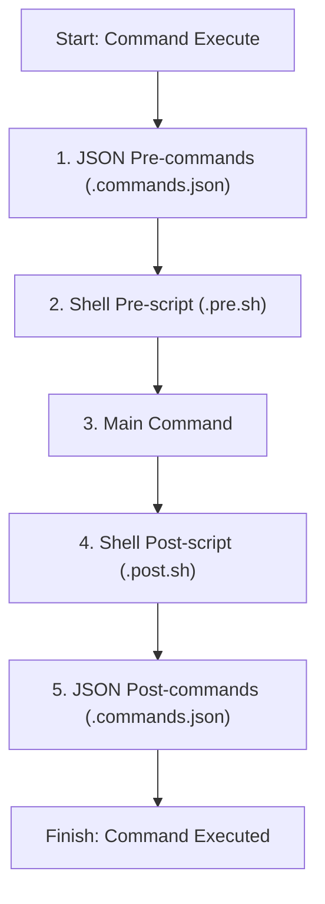

# opencode-plugin-command-hooks

A generic, highly flexible plugin for **OpenCode** that adds powerful hooks and dependency chains to any command execution. It enables you to orchestrate workflows with both **JSON command chains** and **shell scripts** (`.pre.sh` and `.post.sh`) executed recursively with felsenfest execution order and error safety.

---

## Features

- 🛠️ **Command Chains**: Define pre and post command sequences in standard `<command-name>.commands.json` files.
- 🐚 **Shell Scripts**: Automatically run shell scripts (`<command-name>.pre.sh` and `<command-name>.post.sh`) before and after command executions.
- 🎯 **Strict Execution Order**: Guarantees a robust, predictable pipeline sequence.
- 🛑 **Failure Propagation & Safe Abort**: If a pre-command or pre-script fails (non-zero exit code or error), the pipeline aborts immediately, stopping the main command.
- 🔄 **Recursive Support**: Fully supports nested/recursive command invocations natively using OpenCode's command system.
- 📝 **Detailed Logging & Session Output**: Output from pre/post shell scripts is logged to a local file, reported to OpenCode's logs, and printed back directly to the active session when a failure occurs.

---

## Execution Pipeline Order

When a command (e.g. `wiki-sync`) is invoked, the plugin executes hooks in this felsenfest sequence:



### Flow Details
1. **JSON Pre-commands**: Defined in `.opencode/commands/<command>.commands.json`. Executed sequentially. *Any failure aborts the pipeline.*
2. **Shell Pre-script**: Located at `.opencode/commands/<command>.pre.sh`. *Non-zero exit codes abort the pipeline.*
3. **Main Command**: Your command executes.
4. **Shell Post-script**: Located at `.opencode/commands/<command>.post.sh`. Executed for cleanup/logs. *Failure is logged but doesn't abort (main command already ran).*
5. **JSON Post-commands**: Defined in `.opencode/commands/<command>.commands.json`. Executed sequentially. *Failure is logged but doesn't abort.*

---

## Installation

Add the package to your OpenCode project:

```bash
npm install opencode-plugin-command-hooks
```

Or copy the folder directly to your local plugins directory.

---

## Setup & Configuration

### Option 1: Natively Registered Plugin

Create an `opencode.json` configuration file in your project root containing:

```json
{
  "plugin": [
    "@pkcpkc/opencode-plugin-command-hooks"
  ]
}
```

### Option 2: Programmatic Registration

Import and register the plugin in your `.opencode` plugins registration file:

```typescript
import { CommandHooksPlugin } from "opencode-plugin-command-hooks";

export default [
  // Register the plugin with custom options
  CommandHooksPlugin({
    commandsDirectory: ".opencode/commands",
    logLevel: "error", // "debug" | "info" | "warn" | "error"
    logFilePath: ".opencode/plugins/commandHooks.log"
  })
];
```

### Configuration Options

| Option | Type | Default | Description |
|---|---|---|---|
| `commandsDirectory` | `string` | `".opencode/commands"` | Directory where your scripts and command JSON chains reside. |
| `logLevel` | `string` | `"error"` | Log verbosity level for local files and toast messages. |
| `logFilePath` | `string` | `".opencode/plugins/commandHooks.log"` | Absolute or relative path to save execution logs. |

---

## Examples

### 1. Defining a Command Chain (`.commands.json`)

To run multiple dependent commands before and after executing `/wiki-sync`, create a `.opencode/commands/wiki-sync.commands.json` file:

```json
{
  "pre": [
    "/wiki-lint",
    "/wiki-report $2 $3"
  ],
  "post": [
    "/wiki-clean $args"
  ]
}
```

#### Parameter Forwarding & Substitution:
You can pass parent arguments to chained commands using placeholders:
- **`$1`, `$2`, `$3`, ..., `$N`**: Evaluates to the N-th positional parameter from the parent command. Arguments containing spaces are automatically quoted and escaped to preserve them cleanly in the child command.
- **`$args` / `$*` / `$@`**: Passes the entire parent arguments string literally.
- **No Placeholders**: If no placeholders are specified (e.g. `"/wiki-lint"`), the command will receive no arguments from the parent.

*In the example above, if you run `/wiki-sync foo "bar baz" qux`, the plugin will call `/wiki-lint` with no arguments, `/wiki-report` with `"bar baz" qux`, and `/wiki-clean` with `foo "bar baz" qux`.*

### 2. Pre-execution Shell Script (`.pre.sh`)

To run custom checks (like verifying network connection or repository state) before executing a command, create a `.opencode/commands/wiki-sync.pre.sh` file. The parent command's arguments are parsed and forwarded to your script as separate command line arguments, allowing you to use standard positional parameter syntax (`$1`, `$2`, `$3`, etc.):

```bash
#!/bin/bash
# If parent runs `/wiki-sync foo "bar baz"`:
# $1 = "foo"
# $2 = "bar baz"

echo "Verifying vault: $2"
# Exit with non-zero code to block the main command execution
if [ ! -d "./Vaults/$2" ]; then
  echo "Error: Vault $2 does not exist!" >&2
  exit 1
fi
echo "Vault verified successfully."
exit 0
```

### 3. Post-execution Shell Script (`.post.sh`)

To perform post-execution notifications or cleanups, create `.opencode/commands/wiki-sync.post.sh`:

```bash
#!/bin/bash
# Positions parameters ($1, $2, etc.) are passed automatically here as well
echo "Wiki sync for vault $2 completed at $(date)"
# Perfect for running notifications, webhooks, or generating reports
```

---

## Error Handling Matrix

| Phase | Action on Error / Non-zero Exit | Toast Notification | Session Log output |
|---|---|---|---|
| **JSON Pre-commands** | **Aborts execution immediately**. Subsequent hooks and main command do **not** run. | 🔴 Error toast shown | Yes |
| **Shell Pre-script** | **Aborts execution immediately**. Main command does **not** run. | 🔴 Error toast shown | Yes, including stdout & stderr |
| **Shell Post-script** | Logs error. Execution finishes normally. | 🟡 Warning toast shown | Yes (if log level allows) |
| **JSON Post-commands**| Logs error. Execution finishes normally. | 🔴 Error toast shown | Yes |

---

## Development & Build

If you are modifying this plugin:

1. **Install Dependencies**:
   ```bash
   npm install
   ```
2. **Run Tests**:
   ```bash
   npm test
   ```
   *This executes the comprehensive unit/integration test suite via Vitest.*
3. **Build**:
   ```bash
   npm run build
   ```

This generates the bundled output inside `dist/`.

`npm publish --access public`